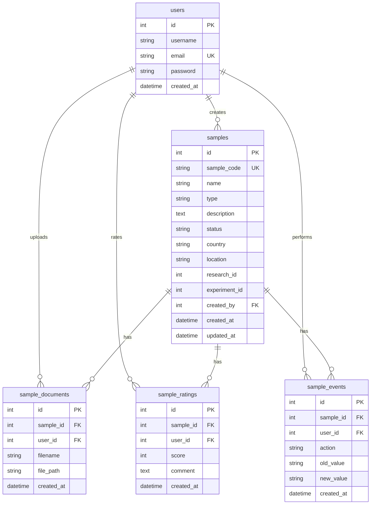

# ERD и схема данных (фаза 1)

Контракт таблиц для учебного Sample Tracking API. Поля, ENUM, переходы статусов и ограничения считаются зафиксированными: менять только если без этого нельзя реализовать ТЗ.

| Документ | Содержание |
|---|---|
| [erd.drawio](./erd.drawio) | ERD, lifecycle, таблицы полей, ограничения, endpoints |
| [api-contract.md](./api-contract.md) | полный текст контракта API |

Открыть draw.io: [diagrams.net](https://app.diagrams.net) → **Open Existing Diagram → Device**.

---

## 1.1. ER-диаграмма

Пять таблиц. Связи только через пользователей и образцы: Project/Experiment в этой БД нет, `research_id` и `experiment_id` — обычные числа (ссылка на большой LIMS, без FK).

```
users
  │
  ├──── 1:N ──── samples          (samples.created_by)
  ├──── 1:N ──── sample_documents (sample_documents.user_id)
  ├──── 1:N ──── sample_ratings   (sample_ratings.user_id)
  └──── 1:N ──── sample_events    (sample_events.user_id)

samples
  ├──── 1:N ──── sample_documents (sample_documents.sample_id)
  ├──── 1:N ──── sample_ratings   (sample_ratings.sample_id)
  └──── 1:N ──── sample_events    (sample_events.sample_id)
```



Этот рисунок — заготовка слайда 4 защиты (ER-диаграмма).

---

## 1.2. Поля

Типы указаны так, как их потом заведут в Sequelize/MySQL. Значения ENUM `type` и `status` фиксируются в п. 1.4 и 1.5.

### users

| Поле | Тип | NULL | По умолчанию | Смысл |
|---|---|---|---|---|
| `id` | INT, PK, AI | нет | auto | |
| `username` | VARCHAR(50) | нет | | логин |
| `email` | VARCHAR(255) | нет | | почта |
| `password` | VARCHAR(255) | нет | | bcrypt-хеш, в JSON не отдаётся |
| `created_at` | DATETIME | нет | NOW | |

Нет `updated_at`: в ТЗ профиль после регистрации почти не меняется.

### samples

| Поле | Тип | NULL | По умолчанию | Смысл |
|---|---|---|---|---|
| `id` | INT, PK, AI | нет | auto | |
| `sample_code` | VARCHAR(32) | нет | | например `SAM-2026-000124` |
| `name` | VARCHAR(100) | нет | | |
| `type` | ENUM | нет | | значения — п. 1.4 |
| `description` | TEXT | да | NULL | |
| `status` | ENUM | нет | `RECEIVED` | значения и переходы — п. 1.5 |
| `country` | VARCHAR(100) | нет | | фильтр как `country` в ТЗ |
| `location` | VARCHAR(255) | да | NULL | текущее место, строка (не дерево склада) |
| `research_id` | INT | да | NULL | id из LIMS, без FK |
| `experiment_id` | INT | да | NULL | id из LIMS, без FK |
| `created_by` | INT, FK → users.id | нет | | владелец записи |
| `created_at` | DATETIME | нет | NOW | |
| `updated_at` | DATETIME | нет | NOW | |

### sample_documents

| Поле | Тип | NULL | По умолчанию | Смысл |
|---|---|---|---|---|
| `id` | INT, PK, AI | нет | auto | |
| `sample_id` | INT, FK → samples.id | нет | | |
| `user_id` | INT, FK → users.id | нет | | кто загрузил (владелец файла) |
| `filename` | VARCHAR(255) | нет | | исходное имя |
| `file_path` | VARCHAR(255) | нет | | путь на диске / URL |
| `created_at` | DATETIME | нет | NOW | |

### sample_ratings

| Поле | Тип | NULL | По умолчанию | Смысл |
|---|---|---|---|---|
| `id` | INT, PK, AI | нет | auto | |
| `sample_id` | INT, FK → samples.id | нет | | |
| `user_id` | INT, FK → users.id | нет | | автор оценки |
| `score` | TINYINT | нет | | 1–5 |
| `comment` | TEXT | да | NULL | |
| `created_at` | DATETIME | нет | NOW | |

Одна оценка на пару (образец, пользователь) — см. 1.3.

### sample_events

| Поле | Тип | NULL | По умолчанию | Смысл |
|---|---|---|---|---|
| `id` | INT, PK, AI | нет | auto | |
| `sample_id` | INT, FK → samples.id | нет | | |
| `user_id` | INT, FK → users.id | нет | | кто совершил действие |
| `action` | VARCHAR(64) | нет | | например `SAMPLE_CREATED`, `STATUS_CHANGED` |
| `old_value` | VARCHAR(255) | да | NULL | было |
| `new_value` | VARCHAR(255) | да | NULL | стало |
| `created_at` | DATETIME | нет | NOW | |

Нет `updated_at`: событие не редактируется.

---

## 1.3. Ограничения

| # | Где | Правило |
|---|---|---|
| PK | все таблицы | `id` PRIMARY KEY AUTO_INCREMENT |
| UNIQUE | `users.email` | повторная регистрация с тем же email → 400 |
| UNIQUE | `samples.sample_code` | код образца не повторяется |
| CHECK | `sample_ratings.score` | целое **от 1 до 5** включительно |
| UNIQUE | `sample_ratings (sample_id, user_id)` | один пользователь — одна оценка на образец |
| INSERT-only | `sample_events` | в API нет PUT/PATCH/DELETE для событий; строку нельзя менять или удалять отдельно |

### Внешние ключи

| Дочерняя колонка | Родитель | ON UPDATE | ON DELETE |
|---|---|---|---|
| `samples.created_by` | `users.id` | CASCADE | RESTRICT |
| `sample_documents.sample_id` | `samples.id` | CASCADE | CASCADE |
| `sample_documents.user_id` | `users.id` | CASCADE | RESTRICT |
| `sample_ratings.sample_id` | `samples.id` | CASCADE | CASCADE |
| `sample_ratings.user_id` | `users.id` | CASCADE | RESTRICT |
| `sample_events.sample_id` | `samples.id` | CASCADE | CASCADE |
| `sample_events.user_id` | `users.id` | CASCADE | RESTRICT |

Пользователя с образцами, файлами, оценками или событиями удалить нельзя (`RESTRICT`). Удаление **образца** владельцем забирает с собой документы, оценки и события (`CASCADE`). Неизменяемость истории — это запрет менять строки `sample_events`, а не сохранение событий после удаления образца.

### INSERT-only для `sample_events` (как соблюдать)

- Не создавать маршрутов `PUT/PATCH/DELETE /events/:id`.
- В Sequelize не вызывать `update` / `destroy` для Event.
- Новые строки пишет только код, который уже изменил sample / document / rating (`SAMPLE_CREATED`, `STATUS_CHANGED`, `LOCATION_CHANGED`, `DOCUMENT_UPLOADED`, `RATING_ADDED`, …).

MySQL CHECK для `score` (8.0.16+ / MariaDB 10.2+):

```sql
CONSTRAINT chk_sample_ratings_score CHECK (score >= 1 AND score <= 5)
```

---

## 1.4. ENUM `type`

Колонка `samples.type`. Неизвестное значение при создании/обновлении → `400`.

```text
BIOLOGICAL | CHEMICAL | ENVIRONMENTAL | FOOD | WATER
SOIL | TISSUE | DNA | RNA | CELL | OTHER
```

| Значение | Пример |
|---|---|
| `BIOLOGICAL` | кровь, слюна |
| `CHEMICAL` | реагент как образец |
| `ENVIRONMENTAL` | воздух / смыв |
| `FOOD` | пищевой продукт |
| `WATER` | вода |
| `SOIL` | почва |
| `TISSUE` | ткань |
| `DNA` | ДНК-экстракт |
| `RNA` | РНК-экстракт |
| `CELL` | клеточная культура |
| `OTHER` | всё остальное |

Код: `server/config/sampleTypes.js`.

---

## 1.5. ENUM `status` и карта переходов

Колонка `samples.status`. При `POST /samples` всегда `RECEIVED`. Дальше только `PATCH /samples/:id/status`.

```text
RECEIVED → REGISTERED → STORED → IN_ANALYSIS → ANALYZED → ARCHIVED → DESTROYED
```

| Из | Можно в | Нельзя |
|---|---|---|
| `RECEIVED` | `REGISTERED` | всё остальное |
| `REGISTERED` | `STORED` | |
| `STORED` | `IN_ANALYSIS` | |
| `IN_ANALYSIS` | `ANALYZED` | |
| `ANALYZED` | `ARCHIVED` | |
| `ARCHIVED` | `DESTROYED` | |
| `DESTROYED` | — | в том числе `STORED` |

Любой шаг не из таблицы, включая `DESTROYED → STORED` → `400` `{ "error": "Invalid status transition" }`.

Ветки `IN_TRANSIT`, `QUALITY_FAILED`, `REJECTED` в учебный API **не входят**.

Код: `server/config/sampleStatuses.js`. Диаграмма — вкладка **Статусы** в `erd.drawio`.

### Действия в `sample_events.action`

`SAMPLE_CREATED`, `SAMPLE_UPDATED`, `STATUS_CHANGED`, `LOCATION_CHANGED`, `DOCUMENT_UPLOADED`, `DOCUMENT_DELETED`, `RATING_ADDED`, `RATING_UPDATED`, `RATING_DELETED`.

Код: `server/config/sampleEvents.js`.

---

## 1.6. Endpoints

Полная таблица, тела запросов и коды 201/400/401/403/404: **[api-contract.md](./api-contract.md)**.

Кратко:

| Метод | Endpoint | Доступ |
|---|---|---|
| POST | `/auth/register` | открытый |
| POST | `/auth/login` | открытый |
| GET | `/auth/me` | JWT |
| POST | `/samples` | JWT |
| GET | `/samples` | открытый |
| GET | `/samples/:id` | открытый |
| PUT | `/samples/:id` | владелец |
| DELETE | `/samples/:id` | владелец |
| PATCH | `/samples/:id/status` | владелец |
| GET | `/samples/:id/history` | открытый |
| GET | `/samples?country=&type=&status=&sort=rating` | открытый |
| POST | `/samples/:id/documents` | JWT |
| GET | `/samples/:id/documents` | открытый |
| DELETE | `/documents/:id` | владелец файла |
| POST | `/samples/:id/ratings` | JWT |
| GET | `/samples/:id/rating` | открытый |
| GET | `/samples/:id/ratings` | открытый |
| PUT | `/ratings/:id` | владелец оценки |
| DELETE | `/ratings/:id` | владелец оценки |

---

## 1.7. Диаграммы draw.io

Всё в [erd.drawio](./erd.drawio). Markdown остаётся источником формулировок; вкладки — визуализация тех же пунктов.

| Вкладка | Откуда |
|---|---|
| ERD — поля и ключи | п. 1.1 |
| ERD — обзор 1:N | п. 1.1 связи |
| Типы образца | п. 1.4 |
| Статусы | п. 1.5 блок-схема |
| Lifecycle timeline | один образец: события + запросы |
| Карта API | п. 1.6 группы |
| 1.2 Поля … | таблицы из `erd.md` |
| 1.3 Ограничения и FK | п. 1.3 |
| 1.5 Таблица переходов | п. 1.5 |
| 1.6 Endpoints / коды / примеры | `api-contract.md` |

---

## Что сознательно не входит в эти 5 таблиц

Нет `locations`, `transfers`, `projects`, `experiments`, `employees`, дерева склада. Место — строка `samples.location`. Исследование — числа `research_id` / `experiment_id`.
